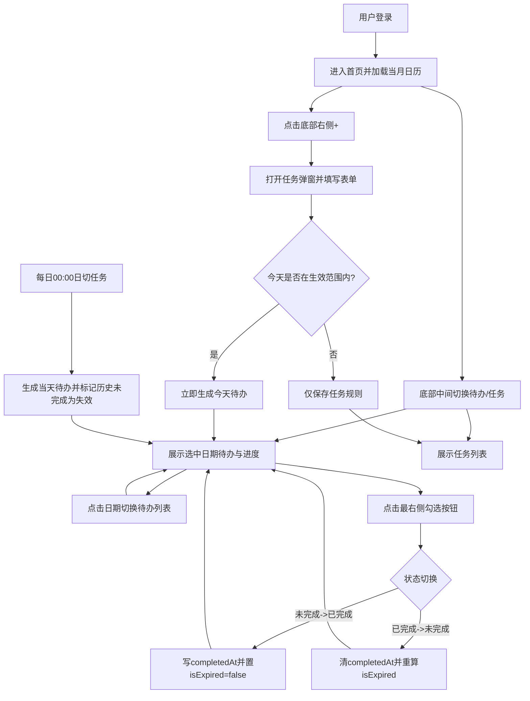
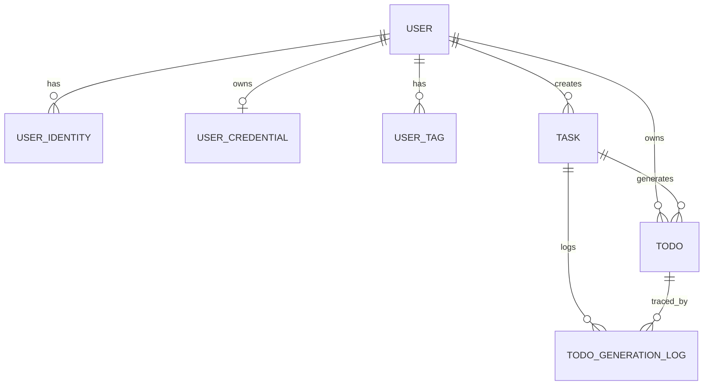
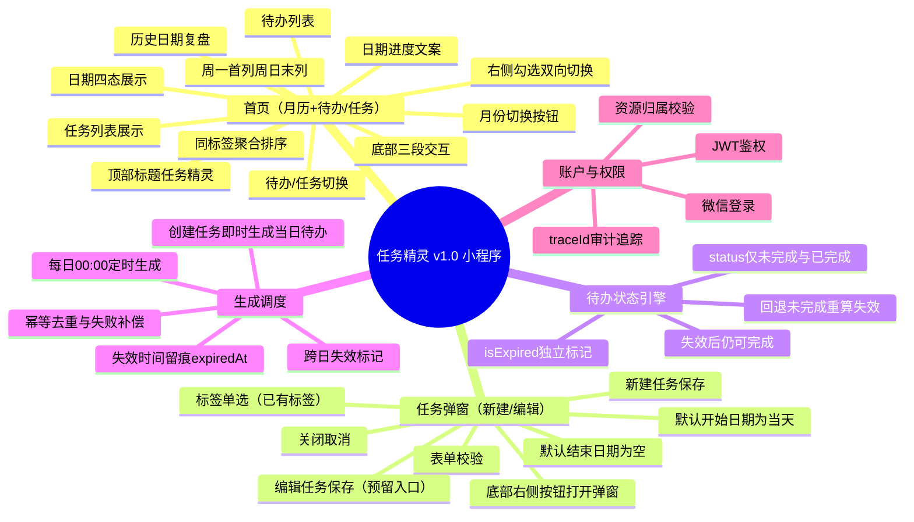

# PRD模板

# 一、版本信息

| **系统版本** | v1 | **创建日期** |   | **撰写人** | 谢天 |
| -------- | -- | -------- | - | ------- | -- |

# 二、变更日志

| **时间** | **文档版本** | **变更人** | **主要变更内容** |
| ------ | -------- | ------- | ---------- |
|        | v1       | 谢天      | 创建文档       |

# 三、需求概述

## 需求背景 

每天都有很多需要完成的待办，但是一段时间过去后，并不知道过去哪天的待办完成了，哪天没完成，不过清晰明了，也不能督促自己完成任务，所以计划开发一个小程序，用程序管理目标。

## 需求目标

- 让用户在首页即可快速感知「今天该做什么、做了多少、还差多少」，形成每日执行闭环。
- 让用户可以使用工具随时随地查看待办，完成待办

## 方案说明

简单描述实现需求的产品方案

## 用户故事

| **#** | **用户故事** | **验收标准** | **优先级** | **版本** |
| ----- | -------- | -------- | ------- | ------ |
| US-01 | 作为用户，我希望首页默认展示当月日历并选中当天，以便进入即用。 | 首次进入显示当月，默认选中当天，支持切换任意日期。 | P0 | v1.0 |
| US-02 | 作为用户，我希望日历能清晰区分日期执行结果，以便快速复盘。 | 日历状态仅有四类：已完成/历史未完成/当日未完成/无待办。 | P0 | v1.0 |
| US-03 | 作为用户，我希望在首页直接看到选中日期的完成进度。 | 日历下方显示文案：`YYYY-MM-DD 已完成X/共Y`，且随勾选实时变化。 | P0 | v1.0 |
| US-04 | 作为用户，我希望勾选按钮固定在待办最右侧，并支持双向切换。 | 点击右侧勾选可在未完成/已完成间切换，切换后列表与日历状态实时刷新。 | P0 | v1.0 |
| US-05 | 作为用户，我希望已失效待办仍可继续完成。 | 待办跨日未完成自动标记失效；补完成后 `isExpired=false`。 | P0 | v1.0 |
| US-06 | 作为用户，我希望只在首页完成复盘，不需要单独历史页。 | 点击历史日期即可查看当日待办，不提供独立历史待办页面。 | P0 | v1.0 |
| US-07 | 作为用户，我希望新增任务通过弹窗完成，避免页面跳转打断。 | 点击底部右侧“+”打开任务弹窗，自动聚焦标题输入框；默认开始日期为当天，结束日期留空即长期有效。 | P0 | v1.0 |
| US-08 | 作为用户，我希望通过左滑快速删除待办，减少多余操作。 | 待办项左滑后展示删除按钮；点击删除后待办被软删除，列表与日历状态同步刷新。 | P0 | v1.0 |
| US-09 | 作为用户，我希望删除结果提示出现在页面顶部且不重复闪动。 | 删除成功/失败后显示顶部轻拟物 Toast；同文案在短时间内触发需防抖，避免重复激活。 | P0 | v1.0 |
| US-10 | 作为用户，我希望任务可关联单个标签并传递到待办，便于按类处理。 | 任务弹窗可从已有标签单选；任务生成待办后下沉 `tagId/tagName`；同标签待办在列表中相邻展示。 | P0 | v1.0 |
| US-11 | 作为用户，我希望首页底部可切换“待办/任务”，并保留快捷创建入口。 | 底部采用左/中/右三段：菜单占位、待办/任务切换、+新建任务；中间支持点击与局部左右滑动切换。 | P0 | v1.0 |
| US-12 | 作为用户，我希望每天22点收到当天待办完成情况通知，并可在提醒设置中配置SendKey与测试发送。 | 菜单进入提醒设置后可保存SendKey、开关通知、测试发送；每天22:00推送文案为“今日待办：未完成X，已完成Y，完成率Z%”。 | P0 | v1.1 |

## 系统规划

| **版本** | **功能** | **预计上线日期** |
| ------ | ------ | :--------- |
| v1.0（第一阶段） | 小程序：首页（月历+待办/任务切换）+任务弹窗（新建/编辑），支持待办双向勾选、左滑删除、任务列表查看、日切失效、日历四态 | TBD |
| v1.1（第二阶段） | 通知功能（22点汇总通知、SendKey配置、测试发送、失败补偿） | TBD |
| v1.2（第三阶段） | AI总结功能（日报/周报/月报，完成率与执行趋势分析） | TBD |
| v1.3（第四阶段） | 其他客户端 | TBD |

# 四、整体说明

## 业务术语

| **类型** | **术语** | **说明** |
| ------ | ------ | :----- |
| 业务概念 | 任务（Task） | 用户定义的计划规则实体，决定在什么时间范围内生成待办。 |
| 业务概念 | 待办（Todo） | 每日执行的具体事项，由任务生成或即时生成。 |
| 业务概念 | 生效范围 | 任务可生成待办的日期区间（开始/结束日期）。 |
| 业务概念 | 日历状态 | 某日期的完成状态：已完成/历史未完成/当日未完成/无待办。 |
| 业务概念 | 0点日切 | 每日 00:00 由云函数定时触发器（config.json triggers，cron: `0 0 0 * * * *`）自动执行"生成当天待办+标记历史未完成为已失效"的批处理机制，无需 HTTP 鉴权。 |
| 业务概念 | 补偿生成 | 0点生成失败后，按日志进行补跑生成。 |
| 业务概念 | 22点汇总通知 | 每日 22:00 汇总当天待办完成情况并推送给开启提醒的用户。 |
| 系统概念 | SendKey | 方糖（Server酱）推送密钥，由用户在提醒设置页配置。 |
| 业务概念 | 软删除 | 标记删除，不物理移除数据，历史可追溯。 |
| 系统概念 | 用户（User） | 业务主用户实体，所有任务与待办归属到 userId。 |
| 系统概念 | 身份映射（UserIdentity） | 外部登录身份与 userId 的映射关系。 |
| 系统概念 | 凭证（UserCredential） | 账号密码登录场景下的密码哈希与安全状态。 |
| 系统概念 | 标签（UserTag） | 用户可选标签主数据，由数据库初始化并供前端单选。 |
| 系统概念 | 幂等键 | 唯一约束 `(userId, taskId, todoDate)`，防重复生成。 |
| 系统概念 | JWT | 服务端签发的访问令牌，用于接口鉴权。 |
| 系统概念 | TraceId | 请求链路追踪标识，用于日志排障。 |

## 权限设计

### 角色定义

- 普通用户：可管理自己的任务与待办，查看自己的日历与统计。
- 系统管理员（预留）：仅用于系统维护与审计，不参与普通业务操作。

### 资源与动作权限

| 角色 | 资源 | 动作 | 权限规则 |
| :-- | :-- | :-- | :-- |
| 普通用户 | task | 创建/查询/修改/删除 | 仅可操作 `userId=本人` 的任务 |
| 普通用户 | todo | 查询/状态切换 | 仅可操作 `userId=本人` 的待办 |
| 普通用户 | user_tag | 查询 | 仅可查询本人可选标签列表（只读） |
| 普通用户 | 日历统计 | 查询 | 仅可查看 `userId=本人` 的统计结果 |
| 普通用户 | user_profile | 查询/修改 | 仅可修改本人昵称、头像等非敏感信息 |
| 普通用户 | user_identity/user_credential | 查询（受限） | 仅允许查看脱敏后的登录方式信息 |
| 系统管理员 | 审计日志 | 查询 | 仅用于故障排查与审计，禁止修改业务数据 |

### 权限控制规则

- 所有接口必须先鉴权（JWT），再做资源归属校验（`resource.userId == token.userId`）。
- 前端隐藏按钮不等于权限控制，后端必须强校验。
- 对跨用户访问统一返回 403。

## 流程说明

### 文字流程

1. 用户登录后进入首页，默认展示当月日历并选中当天，默认视图为“待办”。
2. 用户可通过底部中间切换控件（点击或局部左右滑动）在“待办/任务”之间切换。
3. 用户点击底部右侧“+”打开任务弹窗，默认开始日期为当天，结束日期留空即长期有效。
4. 用户保存任务时，若当天在任务生效范围内，系统立即生成当天待办；任务页可查看已创建任务列表。
5. 用户在待办视图点击某日期后，系统拉取该日期待办，并展示 `已完成X/共Y` 进度；首页进度仅按父任务统计。
6. 用户点击待办最右侧勾选按钮可双向切换状态：未完成↔已完成。
7. 每天 00:00 执行日切任务：生成当天待办，并将昨日及更早未完成待办标记为失效。
8. 历史日期复盘在首页内完成，不提供独立历史待办页面。
9. 每天 22:00 执行汇总通知任务：向已开启提醒且配置了 SendKey 的用户推送“今日待办：未完成X，已完成Y，完成率Z%”。

### Mermaid流程图

## 实体关系

## 数据结构

### 实体一：user（用户实体）

| 字段名 | 数据类型 | 必填 | 说明 |
| :-- | :--- | :- | :- |
| _id | string | 是 | 用户ID（业务主键） |
| nickname | string | 否 | 昵称 |
| avatarUrl | string | 否 | 头像地址 |
| status | number | 是 | 1=正常，0=禁用 |
| lastLoginAt | number | 否 | 最近登录时间戳（毫秒） |
| createdAt | number | 是 | 创建时间戳（毫秒） |
| updatedAt | number | 是 | 更新时间戳（毫秒） |

### 实体二：user_identity（用户身份映射）

| 字段名 | 数据类型 | 必填 | 说明 |
| :-- | :--- | :- | :- |
| _id | string | 是 | 映射ID |
| userId | string | 是 | 关联用户ID（对应 user._id） |
| provider | string | 是 | 身份来源（wechat_miniprogram/password/web/electron） |
| identityKey | string | 是 | 通用身份唯一标识（小程序=openid，密码登录=标准化账号） |
| openid | string | 否 | 微信openid（仅 provider=wechat_miniprogram 时有值） |
| unionid | string | 否 | 微信unionid（同主体多应用统一标识） |
| createdAt | number | 是 | 创建时间戳（毫秒） |
| updatedAt | number | 是 | 更新时间戳（毫秒） |

### 实体三：user_credential（账号密码凭证）

| 字段名 | 数据类型 | 必填 | 说明 |
| :-- | :--- | :- | :- |
| _id | string | 是 | 凭证ID |
| userId | string | 是 | 关联用户ID（对应 user._id） |
| passwordHash | string | 是 | 密码哈希（禁止明文存储） |
| passwordAlgo | string | 是 | 哈希算法标识（如 argon2id） |
| passwordUpdatedAt | number | 是 | 密码更新时间戳（毫秒） |
| failedLoginCount | number | 是 | 连续失败次数 |
| lockUntil | number | 否 | 锁定截止时间戳（毫秒） |
| createdAt | number | 是 | 创建时间戳（毫秒） |
| updatedAt | number | 是 | 更新时间戳（毫秒） |

### 实体四：user_tag（标签主数据）

| 字段名 | 数据类型 | 必填 | 说明 |
| :-- | :--- | :- | :- |
| _id | string | 是 | 标签ID |
| userId | string | 是 | 用户ID |
| name | string | 是 | 标签名称（用户内唯一） |
| color | number | 是 | 颜色索引（0-7，对应8种预设颜色） |
| sort | number | 否 | 排序权重（越小越靠前） |
| isDeleted | boolean | 是 | 软删除标记 |
| createdAt | number | 是 | 创建时间戳（毫秒） |
| updatedAt | number | 是 | 更新时间戳（毫秒） |

### 实体五：task（任务实体）

| 字段名 | 数据类型 | 必填 | 说明 |
| :-- | :--- | :- | :- |
| _id | string | 是 | 任务ID |
| userId | string | 是 | 用户ID |
| title | string | 是 | 任务标题 |
| remark | string | 否 | 备注说明 |
| tagId | string | 否 | 标签ID（关联 user_tag._id） |
| tagName | string | 否 | 标签名称快照 |
| effectiveStartDate | string(date) | 是 | 生效开始日期（yyyy-MM-dd） |
| effectiveEndDate | string(date) | 否 | 生效结束日期（yyyy-MM-dd，为空表示长期有效） |
| repeatRule | object | 是 | 重复规则（默认daily，后续可扩展） |
| status | number | 是 | 1=启用，0=停用 |
| isDeleted | boolean | 是 | 软删除标记 |
| version | number | 是 | 任务版本号，编辑后递增 |
| createdAt | number | 是 | 创建时间戳（毫秒） |
| updatedAt | number | 是 | 更新时间戳（毫秒） |
| deletedAt | number | 否 | 删除时间戳（毫秒） |

### 实体六：todo（待办实例）

| 字段名 | 数据类型 | 必填 | 说明 |
| :-- | :--- | :- | :- |
| _id | string | 是 | 待办ID |
| userId | string | 是 | 用户ID |
| taskId | string | 是 | 来源任务ID |
| taskVersion | number | 是 | 生成时任务版本号 |
| todoDate | string(date) | 是 | 待办所属日期（yyyy-MM-dd） |
| triggerType | string | 是 | 触发类型（create_task/cron_0000/retry） |
| title | string | 是 | 待办标题（从任务快照下沉） |
| tagId | string | 否 | 标签ID快照 |
| tagName | string | 否 | 标签名称快照 |
| completedAt | number | 否 | 完成时间戳（毫秒） |
| status | number | 是 | 1=未完成，2=已完成 |
| isExpired | boolean | 是 | 是否失效（true=已失效，false=未失效） |
| expiredAt | number | 否 | 首次失效时间戳（毫秒） |
| isDeleted | boolean | 是 | 软删除标记 |
| createdAt | number | 是 | 创建时间戳（毫秒） |
| updatedAt | number | 是 | 更新时间戳（毫秒） |
| deletedAt | number | 否 | 删除时间戳（毫秒） |

### 实体七：todo_generation_log（待办生成日志）

| 字段名 | 数据类型 | 必填 | 说明 |
| :-- | :--- | :- | :- |
| _id | string | 是 | 日志ID |
| userId | string | 是 | 用户ID |
| taskId | string | 是 | 任务ID |
| todoDate | string(date) | 是 | 目标生成日期（yyyy-MM-dd） |
| triggerType | string | 是 | 触发类型（create_task/cron_0000/retry） |
| result | string | 是 | 执行结果（success/skipped_duplicate/failed） |
| todoId | string | 否 | 成功生成时对应待办ID |
| errorCode | string | 否 | 失败错误码 |
| errorMessage | string | 否 | 失败信息 |
| traceId | string | 否 | 链路追踪ID |
| createdAt | number | 是 | 创建时间戳（毫秒） |

### 用户与身份关联关系

- `user` 与 `user_identity` 为一对多关系：一个用户可绑定多个身份来源。
- `user` 与 `user_credential` 为一对一（可选）关系：仅当存在账号密码登录时才有记录。
- 登录识别流程（小程序）：`wx.login(code)` -> 服务端换取 `openid` -> 查 `user_identity(provider, identityKey)` -> 定位 `userId` -> 签发 JWT。
- 登录识别流程（账号密码）：服务端先按账号查 `user_identity(provider=password, identityKey=标准化账号)` -> 再校验 `user_credential.passwordHash` -> 成功后签发 JWT。

### 关键约束与规则

- 创建任务时，若当天在任务生效范围内，立即生成当天待办。
- 每天 0 点执行日切任务：为生效中的任务生成当天待办，并将昨日及更早 `status=1(未完成)` 的待办批量标记为 `isExpired=true`，同时写入 `expiredAt`（仅首次写入）。
- 已失效待办仍允许用户继续完成；完成后更新 `status=2(已完成)`、记录 `completedAt`，并将 `isExpired=false`。
- 已完成待办支持再次勾选回退为未完成；回退时清空 `completedAt` 并按待办所属日期重算 `isExpired`。
- 待办状态切换采用乐观更新机制：前端立即更新 UI 并重算进度，后台调用 API；成功后静默刷新服务端数据，失败时回滚到之前状态并提示"操作失败"。
- `expiredAt` 用于保留"曾失效"的历史痕迹，不因完成动作清空。
- 任务标签仅支持单选，标签来源于 `user_tag`；任务保存时写入 `tagId/tagName`。
- 标签颜色索引（0-7）对应8种预设颜色，创建标签时按已有标签数量循环分配，用户可在标签管理页修改。
- 待办生成时下沉任务标签快照：`todo.tagId/todo.tagName`。
- 编辑任务后：
  - 同步更新当天「未完成」待办；
  - 当天「已完成」待办不做修改；
  - 未来待办按新任务规则在后续 0 点生成。
- 删除任务仅软删除 `task`，不影响已生成待办历史。
- 待办幂等唯一键：`(userId, taskId, todoDate)`，防止重复生成。
- 待办列表排序口径：同标签待办聚合展示（按 `tagName`），无标签待办排在最后，组内按 `createdAt` 升序。
- 日历状态计算口径：
  - `uncompletedCount` 定义为 `status=1(未完成)` 的待办数量（包含 `isExpired=true/false`）；
  - 无待办：`todoCount=0`；
  - 已完成：`completedCount=todoCount 且 todoCount>0`；
  - 当日未完成：`targetDate=today 且 uncompletedCount>0`；
  - 历史未完成：`targetDate<today 且 uncompletedCount>0`。

### 索引建议

- `user`：`(status)`
- `user_identity`：唯一索引 `(provider, identityKey)`、`(userId)`
- `user_credential`：唯一索引 `(userId)`
- `user_tag`：唯一索引 `(userId, name)`、`(userId, sort)`
- `task`：`(userId, isDeleted, status)`、`(userId, effectiveStartDate, effectiveEndDate)`
- `todo`：`(userId, todoDate)`、`(userId, todoDate, status)`、`(userId, todoDate, tagName, createdAt)`、唯一索引 `(userId, taskId, todoDate)`
- `todo_generation_log`：`(userId, todoDate)`、`(taskId, todoDate)`

## 功能结构

## 功能清单

通过优先级区分开发顺序，功能描述按“首页 + 任务弹窗 + 调度规则”组织。

| **一级模块** | **二级模块** | **功能** | **功能描述** | **优先级** | **状态** |
| -------- | -------- | ------ | -------- | ------- | :----- |
| 首页 | 页面框架 | 单页承载主流程 | 首页同时承载日历浏览、待办执行、历史复盘，不新增独立历史页 | P0 | 本期 |
| 首页 | 底部导航 | 三段布局 | 底部固定左/中/右三段：菜单占位、待办/任务切换、+新建任务 | P0 | 本期 |
| 首页 | 视图切换 | 待办/任务切换 | 中间切换控件支持点击与局部左右滑动，默认待办视图 | P0 | 本期 |
| 首页 | 顶部区域 | 标题展示 | 顶部仅显示"任务精灵"，不展示口号文案 | P0 | 本期 |
| 首页 | 日历区域 | 月份切换 | 通过左右按钮切换月份并刷新该月状态 | P0 | 本期 |
| 首页 | 日历区域 | 周起始规则 | 日历按周一到周日展示，周日位于最后一列 | P0 | 本期 |
| 首页 | 日历区域 | 日期四态 | 日期状态固定为：已完成/历史未完成/当日未完成/无待办 | P0 | 本期 |
| 首页 | 日期信息 | 进度文案 | 在选中日期后显示 `已完成X/共Y`，不展示“进度”字样与筛选区 | P0 | 本期 |
| 首页 | 待办列表 | 列表字段 | 每行展示标题、标签（可选）、失效标记（可选）、最右侧勾选按钮；左滑后显示删除按钮 | P0 | 本期 |
| 首页 | 待办列表 | 标签聚合排序 | 同标签待办在列表中相邻展示，无标签排在最后 | P0 | 本期 |
| 首页 | 待办列表 | 勾选双向切换 | 勾选按钮支持未完成->已完成、已完成->未完成 | P0 | 本期 |
| 首页 | 待办列表 | 左滑删除 | 待办项向左滑动后展示删除按钮；点击删除后立即刷新列表与月历状态 | P0 | 本期 |
| 首页 | 待办列表 | 失效与未完成口径 | 已失效待办仍计入未完成统计，并可补完成 | P0 | 本期 |
| 首页 | 任务列表 | 列表展示 | 切换至任务视图后展示已创建任务（标题、标签、重复文案、生效区间） | P0 | 本期 |
| 首页 | 交互反馈 | 顶部Toast提示 | 删除成功/失败在页面上方展示提示，并做同文案防抖抑制重复激活 | P0 | 本期 |
| 首页 | 交互约束 | 入口收敛 | 列表不提供筛选、编辑任务、删除任务入口；待办删除仅通过左滑按钮触发 | P0 | 本期 |
| 任务弹窗 | 打开方式 | 底部右侧按钮打开 | 点击底部右侧“+”以弹窗形式打开，不进行页面跳转 | P0 | 本期 |
| 任务弹窗 | 默认值 | 日期默认规则 | 新建模式默认开始日期为当天，结束日期为空（长期有效），状态默认启用 | P0 | 本期 |
| 任务弹窗 | 标签选择 | 单选已有标签 | 标签字段位于备注下方，仅允许从已有标签中单选 | P0 | 本期 |
| 任务弹窗 | 表单校验 | 规则校验 | 标题必填；开始日期<=结束日期（结束可空） | P0 | 本期 |
| 任务弹窗 | 保存逻辑 | 新建任务保存 | 保存成功后关闭弹窗并刷新首页；当天命中范围则即时生成待办 | P0 | 本期 |
| 任务弹窗 | 保存逻辑 | 编辑任务保存 | 编辑后仅同步当天未完成待办，已完成待办不回写（编辑入口预留） | P1 | 预留 |
| 生成调度 | 定时任务 | 每日00:00生成 | 扫描生效任务并批量生成当天待办 | P0 | 本期 |
| 生成调度 | 日切失效 | 自动标记失效 | 每日00:00将昨日及更早 `status=1` 待办置为 `isExpired=true`，写 `expiredAt` | P0 | 本期 |
| 生成调度 | 状态回写 | 完成后取消失效 | 失效待办完成时 `status=2` 且 `isExpired=false` | P0 | 本期 |
| 生成调度 | 一致性保障 | 幂等去重与补偿 | 使用 `(userId,taskId,todoDate)` 防重；失败记录支持补偿重跑 | P0 | 本期 |
| 账户与权限 | 身份认证 | 微信登录与签发凭证 | 通过 openid 映射 userId，签发访问令牌 | P0 | 本期 |
| 账户与权限 | 鉴权控制 | 资源归属校验 | 接口仅允许访问本人日历、任务、待办 | P0 | 本期 |

### 状态说明

#### 任务（Task）业务状态

| **状态** | **前置条件** | **后置条件** | **备注** |
| ------ | -------- | -------- | ------ |
| 启用（status=1） | 任务创建成功且未停用 | 可参与0点生成及即时生成 | 默认状态 |
| 停用（status=0） | 用户手动停用任务 | 不再生成未来待办 | 历史待办不受影响 |

> `isDeleted` 为数据删除标记，不作为任务业务状态枚举。

#### 待办（Todo）执行状态

| **状态** | **前置条件** | **后置条件** | **备注** |
| ------ | -------- | -------- | ------ |
| 未完成（status=1） | 待办创建成功，或由已完成回退 | 可再次勾选为已完成 | 已失效待办也属于未完成 |
| 已完成（status=2） | 用户勾选完成待办 | 记录 `completedAt`，并将 `isExpired=false` | 支持再次勾选回退为未完成 |

#### 待办（Todo）失效标记状态

| **状态** | **前置条件** | **后置条件** | **备注** |
| ------ | -------- | -------- | ------ |
| 未失效（isExpired=false） | 待办所属日期未超期，或超期后已完成 | 列表不展示失效标记 | 完成态必须是未失效 |
| 已失效（isExpired=true） | 待办所属日期当天24:00后仍 `status=1` | 可继续完成；完成后回到未失效 | `expiredAt` 记录首次失效时间 |

#### 日历日期状态

| **状态** | **前置条件** | **后置条件** | **备注** |
| ------ | -------- | -------- | ------ |
| 无待办 | todoCount=0 | 日期显示“无待办”样式 | 用于区分空白日 |
| 已完成 | completedCount=todoCount 且 todoCount>0 | 日期显示“已完成”样式 | 不区分是否曾失效 |
| 当日未完成 | targetDate=today 且 uncompletedCount>0 | 日期显示“当日未完成”样式 | 强调当天执行缺口 |
| 历史未完成 | targetDate<today 且 uncompletedCount>0 | 日期显示“历史未完成”样式 | 包含 `isExpired=true` 的未完成待办 |

# 五、功能需求

## 首页（月历+待办/任务主视图）

### 页面说明

| **#** | **对象** | **说明**      |
| ----- | ------ | ----------- |
| 1 | 页面定位 | 首页承载“月历总览+待办执行+历史复盘”主流程。 |
| 2 | 页面布局 | 上半区为月历，下半区根据视图展示“进度+待办列表”或“任务列表”；底部固定左/中/右三段交互。 |
| 3 | 数据来源 | 月历状态来自按月聚合查询；待办列表来自按日期查询；默认查询日期为当天。 |

### 权限说明

| **#** | **角色** | **权限** |
| ----- | ------ | ------ |
| 1 | 普通用户 | 仅可查看本人月历状态与待办列表，仅可操作本人待办状态切换与删除。 |
| 2 | 系统管理员（预留） | 仅用于审计查询，不参与前台页面操作。 |

### 查询说明

| **#** | **对象** | **交互说明** | **逻辑说明** | **备注** |
| ----- | ------ | -------- | -------- | ------ |
| 1 | 月历月份 | 点击左右按钮切换月份并刷新当月状态 | 查询维度为 `userId + month`，返回日期状态映射 | 默认打开当月 |
| 2 | 日历日期 | 点击日期后切换待办列表 | 查询维度为 `userId + selectedDate` | 默认选中今天 |
| 3 | 视图切换 | 点击/滑动中间切换控件 | 切换至任务视图时查询 `GET /api/v1/tasks`；切回待办不重置已选日期 | 切换仅在中间控件区域生效 |
| 4 | 页面刷新 | 下拉刷新按当前视图拉取数据 | 待办视图刷新月历+待办；任务视图刷新任务列表 | 刷新需带加载态 |

### 列表说明

| **#** | **对象**  | **交互说明**       | **逻辑说明** | **备注** |
| ----- | ------- | -------------- | -------- | ------ |
| 1 | 列表排序 | 默认按标签聚合排序（同标签相邻，无标签最后），组内按 `createdAt` 升序 | 同一日期内刷新前后顺序不抖动 | 可按体验微调 |
| 2 | 列表行结构 | 每行展示：标题、标签（可选）、失效标记（可选）、最右侧勾选按钮；左滑后显示删除按钮 | 唯一键为 `todo._id` | 删除按钮默认隐藏，仅左滑露出 |
| 3 | 进度信息 | 展示“已完成X/共Y” | 统计范围为“选中日期且未删除的父待办”，子任务仍展示在列表中但不计入进度 | 不展示筛选与完成率文案 |

### 功能说明

| **#** | **对象** | **交互说明** | **逻辑说明** | **备注** |
| ----- | ------ | -------- | -------- | ------ |
| 1 | 勾选切换 | 点击最右侧勾选按钮切换待办状态 | 未完成->已完成：写 `completedAt` 且 `isExpired=false`；已完成->未完成：清 `completedAt` 并重算 `isExpired` | 支持失效后补完成与撤销完成 |
| 2 | 左滑删除 | 待办项向左滑动显示删除按钮，点击后删除 | 删除调用 `DELETE /api/v1/todos/{todoId}` 软删除；成功后刷新待办列表与月历状态 | 同一时刻仅允许一个待办展示删除按钮 |
| 3 | 删除反馈 | 删除成功/失败后在页面顶部展示 Toast | Toast 需避让自定义导航栏；同文案短时间重复触发需防抖 | 优先使用全局可复用组件 |
| 4 | 任务列表浏览 | 切换到任务视图后展示任务卡片 | 第一行展示标题 + 标签（可选，右上角）；第二行展示重复文案（有重复时显示）+ 生效区间（右侧）；重复文案规则：周一至周日全选显示“重复：每日”，连续3天及以上显示区间（如“重复：周一~周三”），其余按“、”枚举；支持下拉刷新 | 本期仅查看，不提供编辑入口 |
| 5 | 新建任务入口 | 点击底部右侧“+”打开任务弹窗 | 弹窗默认“新建模式”，开始日期为当天，结束日期为空（长期有效） | 非页面跳转 |
| 6 | 菜单提醒设置入口 | 点击底部左侧菜单按钮进入“提醒设置” | 支持配置SendKey、开关22:00汇总通知、测试发送通知 | 每个用户仅维护一份配置 |
| 7 | 历史复盘 | 点击历史日期查看该日待办 | 不提供独立历史页，复盘在首页内完成 | 满足轻量交互目标 |
| 8 | 交互边界 | 首页不提供筛选、编辑任务、删除任务入口 | 将操作聚焦在“查看+切换+勾选+左滑删除+新建” | 降低复杂度 |

### 状态说明

状态机或者数据的几种状态说明

| **状态** | **前置条件** | **后置条件** | **备注** |
| ------ | -------- | -------- | ------ |
| 页面加载中 | 首次进入或下拉刷新触发 | 展示骨架/加载态，完成后进入内容态 | 失败进入错误态 |
| 页面内容态（待办） | 月历与待办数据加载成功 | 可执行勾选切换、切换日期、左滑删除等操作 | 默认状态 |
| 页面内容态（任务） | 任务列表数据加载成功 | 可浏览任务信息并下拉刷新 | 由中间切换控件进入 |
| 空列表态 | 选中日期无待办 | 展示“无待办”提示与新建任务引导 | 不影响月历展示 |
| 页面错误态 | 接口失败或网络异常 | 可点击重试恢复内容态 | 不清空本地选中日期 |

## 任务弹窗（新建/编辑）

### 页面说明

| **#** | **对象** | **说明** |
| ----- | ------ | ----------- |
| 1 | 视图定位 | 弹窗为首页浮层视图，承载任务新建与编辑，不新增路由页面。 |
| 2 | 交互模式 | 同一弹窗支持“新建模式/编辑模式”，标题与按钮文案随模式切换。 |
| 3 | 数据来源 | 新建时使用默认值；编辑时按 `taskId` 回填任务详情。 |
| 4 | 展现方式 | 弹窗自底部快速上滑进入，面板高度约为屏幕 `4/5`（80vh）。 |
| 5 | 底部按钮 | "取消/保存"按钮文案需保持上下居中，且按钮区固定在弹窗底部。 |
| 6 | 自动聚焦 | 打开新建弹窗时自动聚焦标题输入框并弹出键盘，输入框设置 `adjust-position=false` 防止键盘顶起弹窗。 |
| 7 | 表单标签 | 任务标题和备注说明不显示 label，通过 placeholder 提示用途；标签与日期选择器保留 label。 |

### 权限说明

| **#** | **角色** | **权限** |
| ----- | ------ | ------ |
| 1 | 普通用户 | 仅可新建/编辑本人任务。 |
| 2 | 系统管理员（预留） | 不参与该弹窗交互。 |

### 查询说明

| **#** | **对象** | **交互说明** | **逻辑说明** | **备注** |
| ----- | ------ | -------- | -------- | ------ |
| 1 | 打开新建弹窗 | 首页点击底部右侧“+” | 初始化默认值：开始日期=当天，结束日期为空（长期有效），状态默认启用；自动聚焦标题输入框 | 无需预查询 |
| 2 | 打开编辑弹窗 | 通过任务管理入口打开（本期预留） | 先查询任务详情，再回填表单 | 本期不在首页列表提供编辑入口 |
| 3 | 加载标签选项 | 弹窗打开后拉取已有标签 | 数据来自 `user_tag`，只读单选 | 标签由数据库初始化，前端不提供维护入口 |

### 功能说明

| **#** | **对象** | **交互说明** | **逻辑说明** | **备注** |
| ----- | ------ | -------- | -------- | ------ |
| 1 | 表单校验 | 点击保存前校验必填项与日期范围 | 标题必填；开始日期<=结束日期（结束可空） | 校验失败不提交 |
| 2 | 标签单选 | 在备注下方选择标签 | 仅允许选择已有标签（单选），保存时写入 `task.tagId/tagName` | 可不选标签 |
| 3 | 新建任务 | 新建模式点击保存 | 创建任务成功后关闭弹窗并刷新首页数据 | 当天在范围内需即时生成待办并下沉标签 |
| 4 | 编辑任务 | 编辑模式点击保存 | 更新任务后关闭弹窗并刷新首页数据 | 仅同步当天未完成待办（含标签） |
| 5 | 取消关闭 | 点击取消/关闭按钮，或点击弹窗外空白区域 | 丢弃未保存修改并关闭弹窗 | 可加二次确认 |
| 6 | 快捷新增标签 | 点击标签区域"+新增标签"纯文字入口 | 打开带背景遮罩的新增标签弹窗，表单结构与标签管理一致；创建成功后自动刷新标签选项并默认选中新建标签 | 复用 `POST /api/v1/tags` 接口 |

## 待办编辑弹窗

### 页面说明

| **#** | **对象** | **说明** |
| ----- | ------ | ----------- |
| 1 | 视图定位 | 弹窗为首页浮层视图，承载待办快照字段编辑，不回写任务定义。 |
| 2 | 触发入口 | 点击首页待办卡片打开编辑弹窗。 |
| 3 | 数据来源 | 按 `todoId` 回填待办详情（标题、备注、标签）。 |
| 4 | 展现方式 | 弹窗自底部快速上滑进入，面板高度约为屏幕 `4/5`（80vh）。 |
| 5 | 底部按钮 | "取消/保存"按钮文案需保持上下居中，且按钮区固定在弹窗底部。 |
| 6 | 键盘策略 | 编辑待办默认不弹出键盘，用户点击输入框后手动激活。 |
| 7 | 表单标签 | 待办标题和备注不显示 label，通过 placeholder 提示用途；标签选择器保留 label。 |

### 权限说明

| **#** | **角色** | **权限** |
| ----- | ------ | ------ |
| 1 | 普通用户 | 仅可编辑本人待办。 |
| 2 | 系统管理员（预留） | 不参与该弹窗交互。 |

### 查询说明

| **#** | **对象** | **交互说明** | **逻辑说明** | **备注** |
| ----- | ------ | -------- | -------- | ------ |
| 1 | 打开编辑弹窗 | 首页点击待办卡片 | 先查询待办详情，再回填表单（标题、备注、标签） | 调用 `GET /api/v1/todos?date=xxx` 获取待办列表 |
| 2 | 加载标签选项 | 弹窗打开后拉取已有标签 | 数据来自 `user_tag`，只读单选 | 调用 `GET /api/v1/tags/options` |

### 功能说明

| **#** | **对象** | **交互说明** | **逻辑说明** | **备注** |
| ----- | ------ | -------- | -------- | ------ |
| 1 | 表单校验 | 点击保存前校验必填项 | 标题必填 | 校验失败不提交 |
| 2 | 标签单选 | 在备注下方选择标签 | 仅允许选择已有标签（单选），保存时写入 `todo.tagId/tagName` | 可不选标签 |
| 3 | 保存待办 | 点击保存 | 调用 `PATCH /api/v1/todos/{todoId}` 更新待办快照字段（标题/备注/标签），不回写任务定义；成功后关闭弹窗并刷新首页待办列表 | 仅更新待办，不影响任务 |
| 4 | 取消关闭 | 点击取消/关闭按钮，或点击弹窗外空白区域 | 丢弃未保存修改并关闭弹窗 | 可加二次确认 |

### 状态说明

| **状态** | **前置条件** | **后置条件** | **备注** |
| ------ | -------- | -------- | ------ |
| 弹窗加载中 | 打开编辑弹窗后拉取待办详情与标签选项 | 数据加载成功后进入编辑态 | 失败进入错误态 |
| 弹窗编辑态 | 数据加载成功并回填表单 | 可修改标题、备注、标签并保存 | 默认状态 |
| 弹窗保存中 | 点击保存触发 | 保存成功关闭弹窗并刷新列表，失败展示错误提示 | 保存期间禁用按钮 |

## 标签管理页

### 页面说明

| **#** | **对象** | **说明** |
| ----- | ------ | ----------- |
| 1 | 页面定位 | 独立页面，承载用户标签的 CRUD 管理。 |
| 2 | 页面布局 | 顶部自定义导航栏，中间标签列表，底部固定"新建标签"按钮。 |
| 3 | 数据来源 | 标签列表来自 `GET /api/v1/tags`，按 `sort` 升序排列。 |
| 4 | 弹窗形式 | 新建/编辑标签采用抽屉弹窗（带背景遮罩），表单包含标签名称与排序权重。 |
| 5 | 键盘避让 | 标签弹窗在键盘弹出时按键盘高度上移，键盘收起后自动回落；监听仅在弹窗显示期间生效。 |

### 权限说明

| **#** | **角色** | **权限** |
| ----- | ------ | ------ |
| 1 | 普通用户 | 仅可管理本人标签（创建/编辑/删除）。 |
| 2 | 系统管理员（预留） | 不参与该页面交互。 |

### 查询说明

| **#** | **对象** | **交互说明** | **逻辑说明** | **备注** |
| ----- | ------ | -------- | -------- | ------ |
| 1 | 标签列表 | 进入页面后拉取标签列表 | 查询维度为 `userId`，返回按 `sort` 升序排列的标签列表 | 调用 `GET /api/v1/tags` |
| 2 | 打开新建弹窗 | 点击底部"新建标签"按钮 | 初始化默认值：标签名称为空，排序权重自动递增 | 无需预查询 |
| 3 | 打开编辑弹窗 | 点击标签列表项 | 先查询标签详情（包含在列表中），再回填表单 | 复用列表数据，无需额外查询 |

### 列表说明

| **#** | **对象**  | **交互说明**       | **逻辑说明** | **备注** |
| ----- | ------- | -------------- | -------- | ------ |
| 1 | 列表排序 | 按 `sort` 升序排列 | 排序权重越小越靠前 | 可手动调整排序权重 |
| 2 | 列表行结构 | 每行展示：标签名称、排序权重；左滑后显示删除按钮 | 唯一键为 `tag._id` | 删除按钮默认隐藏，仅左滑露出 |

### 功能说明

| **#** | **对象** | **交互说明** | **逻辑说明** | **备注** |
| ----- | ------ | -------- | -------- | ------ |
| 1 | 新建标签 | 点击底部"新建标签"按钮打开弹窗 | 填写标签名称与排序权重，保存后调用 `POST /api/v1/tags` 创建标签；成功后关闭弹窗并刷新列表 | 标签名称在用户内唯一 |
| 2 | 编辑标签 | 点击标签列表项打开编辑弹窗 | 回填标签名称与排序权重，保存后调用 `PUT /api/v1/tags/{tagId}` 更新标签；成功后关闭弹窗并刷新列表 | 编辑后同步影响关联任务与待办的标签名称快照 |
| 3 | 左滑删除 | 标签项向左滑动显示删除按钮，点击后删除 | 删除调用 `DELETE /api/v1/tags/{tagId}` 软删除；成功后刷新列表 | 同一时刻仅允许一个标签展示删除按钮 |
| 4 | 删除反馈 | 删除成功/失败后在页面顶部展示 Toast | Toast 需避让自定义导航栏；同文案短时间重复触发需防抖 | 优先使用全局可复用组件 |
| 5 | 表单校验 | 保存前校验标签名称 | 标签名称必填且在用户内唯一 | 校验失败不提交 |

### 状态说明

| **状态** | **前置条件** | **后置条件** | **备注** |
| ------ | -------- | -------- | ------ |
| 页面加载中 | 首次进入或下拉刷新触发 | 展示骨架/加载态，完成后进入内容态 | 失败进入错误态 |
| 页面内容态 | 标签列表加载成功 | 可新建/编辑/删除标签 | 默认状态 |
| 空列表态 | 用户无标签 | 展示"暂无标签"提示与新建引导 | 不影响新建按钮 |
| 弹窗编辑态 | 新建/编辑弹窗打开 | 可修改标签名称与排序权重并保存 | 键盘弹出时弹窗上移 |
| 页面错误态 | 接口失败或网络异常 | 可点击重试恢复内容态 | 不清空本地数据 |

## 提醒设置页

### 页面说明

| **#** | **对象** | **说明** |
| ----- | ------ | ----------- |
| 1 | 页面定位 | 独立页面，承载用户通知配置的管理。 |
| 2 | 页面布局 | 顶部自定义导航栏，中间配置表单（SendKey输入、通知开关），底部"测试发送"与"保存配置"按钮。 |
| 3 | 数据来源 | 配置数据来自 `GET /api/v1/notifications/settings`。 |
| 4 | AI预览区 | 前台已隐藏"生成AI正文预览"临时调试区域，仅保留后端接口 `/api/v1/notifications/preview-content`。 |

### 权限说明

| **#** | **角色** | **权限** |
| ----- | ------ | ------ |
| 1 | 普通用户 | 仅可管理本人通知配置。 |
| 2 | 系统管理员（预留） | 不参与该页面交互。 |

### 查询说明

| **#** | **对象** | **交互说明** | **逻辑说明** | **备注** |
| ----- | ------ | -------- | -------- | ------ |
| 1 | 加载配置 | 进入页面后拉取通知配置 | 查询维度为 `userId`，返回 SendKey（脱敏）、通知开关状态 | 调用 `GET /api/v1/notifications/settings` |

### 功能说明

| **#** | **对象** | **交互说明** | **逻辑说明** | **备注** |
| ----- | ------ | -------- | -------- | ------ |
| 1 | 配置SendKey | 输入框填写方糖服务酱 SendKey | SendKey 长度校验（非空），保存后脱敏展示（仅显示前4位与后4位） | 调用 `PUT /api/v1/notifications/settings` |
| 2 | 开关通知 | 切换开关控制每日22点汇总通知 | 开关状态与 SendKey 配置联动，SendKey 为空时禁用开关 | 保存后立即生效，22:00定时任务按 `enabled=true` 筛选用户 |
| 3 | 测试发送 | 点击"测试发送"按钮 | 调用 `POST /api/v1/notifications/test-send`，立即推送当天待办汇总通知（标题与AI输入统计仅按父任务计算，正文优先AI生成且仅包含父任务标题与备注）；成功后展示"发送成功"提示与发送时间戳 | 失败展示错误提示，不影响保存配置 |
| 4 | 保存配置 | 点击"保存配置"按钮 | 调用 `PUT /api/v1/notifications/settings` 保存 SendKey 与通知开关；成功后展示"保存成功"提示 | 保存不触发通知发送 |
| 5 | 表单校验 | 保存前校验 SendKey 格式 | SendKey 非空时需符合方糖服务酱格式要求 | 校验失败不提交 |

### 状态说明

| **状态** | **前置条件** | **后置条件** | **备注** |
| ------ | -------- | -------- | ------ |
| 页面加载中 | 首次进入触发 | 展示骨架/加载态，完成后进入内容态 | 失败进入错误态 |
| 页面内容态 | 配置数据加载成功 | 可修改 SendKey、开关通知、测试发送、保存配置 | 默认状态 |
| 测试发送中 | 点击"测试发送"触发 | 发送成功展示成功提示与时间戳，失败展示错误提示 | 发送期间禁用按钮 |
| 保存配置中 | 点击"保存配置"触发 | 保存成功展示成功提示，失败展示错误提示 | 保存期间禁用按钮 |
| 页面错误态 | 接口失败或网络异常 | 可点击重试恢复内容态 | 不清空本地数据 |

## 菜单页

### 页面说明

| **#** | **对象** | **说明** |
| ----- | ------ | ----------- |
| 1 | 页面定位 | 独立页面，作为功能入口导航。 |
| 2 | 页面布局 | 顶部自定义导航栏（计算 statusBarHeight 与 navBarHeight），中间功能入口列表。 |
| 3 | 功能入口 | 包含"标签管理"与"提醒设置"两个主要入口。 |

### 权限说明

| **#** | **角色** | **权限** |
| ----- | ------ | ------ |
| 1 | 普通用户 | 仅可访问本人菜单与功能入口。 |
| 2 | 系统管理员（预留） | 不参与该页面交互。 |

### 功能说明

| **#** | **对象** | **交互说明** | **逻辑说明** | **备注** |
| ----- | ------ | -------- | -------- | ------ |
| 1 | 标签管理入口 | 点击"标签管理"跳转至标签管理页 | 路由跳转至 `/pages/tag/index` | 非弹窗形式 |
| 2 | 提醒设置入口 | 点击"提醒设置"跳转至提醒设置页 | 路由跳转至 `/pages/notification/index` | 非弹窗形式 |

### 状态说明

| **状态** | **前置条件** | **后置条件** | **备注** |
| ------ | -------- | -------- | ------ |
| 页面内容态 | 进入菜单页 | 展示功能入口列表 | 默认状态，无需加载数据 |

## 定时任务机制

### 功能说明

| **#** | **对象** | **触发方式** | **逻辑说明** | **备注** |
| ----- | ------ | -------- | -------- | ------ |
| 1 | 日切任务（00:00） | 定时触发器 `dailyRollover`，每日00:00执行 | 调用 `POST /api/v1/internal/daily-rollover`，扫描生效中的任务（`status=1, isDeleted=false`），为当天在生效范围内的任务批量生成待办；同时将昨日及更早 `status=1(未完成)` 的待办批量标记为 `isExpired=true`，并写入 `expiredAt`（仅首次写入） | 使用 `(userId,taskId,todoDate)` 唯一键防重复生成；失败记录日志并支持补偿重跑 |
| 2 | 汇总通知（22:00） | 定时触发器 `dailySummaryNotify`，每日22:00执行 | 调用 `POST /api/v1/internal/daily-summary-notify`，扫描 `enabled=true` 的用户，按用户查询当天父任务待办汇总（未完成数、已完成数、完成率）；推送标题固定为"今日待办：未完成X，已完成Y，完成率Z%"，标题与AI输入统计统一仅按父任务计算，正文优先由AI生成（仅包含父任务标题与备注），失败时自动回退固定模板；通过方糖服务酱推送 | AI调用失败或超时不影响通知发送主流程；记录发送日志并支持后续补偿重试 |
| 3 | 触发器识别 | 兼容识别 `event.Type/event.type` 与 `event.TriggerName/event.triggerName` | 定时事件优先走定时分流逻辑，避免误走 HTTP `path` 校验；未知触发器返回错误码 40001 并记录告警日志 | 提升定时触发器兼容性 |

### 状态说明

| **状态** | **前置条件** | **后置条件** | **备注** |
| ------ | -------- | -------- | ------ |
| 任务执行中 | 定时触发器触发 | 执行业务逻辑并记录日志 | 记录 traceId 用于链路追踪 |
| 任务执行成功 | 业务逻辑执行完成 | 记录成功日志，返回200 | 日切任务生成待办并标记失效，汇总通知推送成功 |
| 任务执行失败 | 业务逻辑异常 | 记录失败日志（包含错误码与错误信息），返回500 | 支持后续补偿重试，不影响其他用户 |

# 六、非功能需求

## 变更补充（2026-03-19 标签胶囊尺寸对齐）
1. 首页任务弹窗标签胶囊尺寸与“重复”星期胶囊统一，前端样式口径更新为：`font-size 24rpx`、`height 64rpx`、`padding 0 16rpx`、`min-width 94rpx`。
2. 本次变更仅涉及展示层样式，不涉及任务/待办/标签的数据结构、业务流程与接口参数。
3. 任务弹窗与待办弹窗复用同一标签胶囊样式，尺寸将保持一致，降低视觉与维护成本。

## 变更补充（2026-03-19 子任务能力）
1. 任务新增子任务配置：`subTaskEnabled`（默认`false`）与`subTasks[]`（开启时至少1条，每条含标题）。
2. 任务开启子任务后，系统在生成当日待办时创建“1条父待办 + N条子待办”，子待办与父待办通过父子关系字段关联。
3. 父待办完成门禁：当存在未完成子待办时，父待办不可手动完成，需返回提示“请完成子待办”。
4. 自动完成规则：同一父待办下子待办全部完成后，父待办自动标记为完成；若后续子待办回退为未完成，父待办自动回退为未完成。
5. 编辑任务同步规则扩展：仅同步当天“未完成”父待办与子待办快照字段（标题/标签/版本），已完成待办不回写。
6. 本次变更不新增路由页，交互仍在首页任务弹窗与待办列表内闭环完成。
## 变更补充（2026-03-19 AI子任务自动拆解）
1. 开启子任务时调用AI拆解，入参包含标题和备注（任一非空即可触发）。
2. 加载文案为“AI思考中”，请求8秒内返回即关闭；超时或无结果提示“AI没有建议呢”。
3. 新增独立接口：`/api/v1/ai/subtasks/split`，复用AI通用调用能力，不耦合通知业务。
4. AI输出仅基于输入内容，禁止编造与无意义扩展，并保留手动编辑入口；同时在控制台打印AI返回结果用于调试。

## 变更补充（2026-03-20 待办子任务折叠交互）
1. 待办列表中，父待办底部新增子待办折叠按钮，按钮图形为“两条横线（上长下短）”。
2. 点击该按钮可在“折叠/展开子待办”之间切换，仅影响当前父待办下的子待办显示。
3. 新创建的父子待办默认折叠子待办；折叠按钮居中展示，采用无边框灰色低高度样式，避免显著增加待办卡片高度。
4. 本次为前端交互层变更，不涉及后端接口与数据库字段调整。

## 变更补充（2026-03-20 父任务标记）
1. 任务列表中，若任务存在有效子任务配置（父子任务），则在任务标题左侧展示“父”标记。
2. “父”标记视觉样式与待办列表中的“子”标记保持一致，用于统一父子层级识别语言。
3. 本次变更仅涉及任务卡片展示层，不涉及任务接口字段与业务流转规则调整。

## 变更补充（2026-03-20 长期有效文案收敛）
1. 任务卡片中，当有效时间范围为长期有效（结束日期为空）时，仅展示“长期有效”。
2. 长期有效场景不再展示“开始日期 ~ 长期有效”，避免卡片文案冗长。
3. 本次仅为展示文案调整，不涉及任务数据结构、接口参数与业务逻辑变更。

## 变更补充（2026-03-20 待办编辑支持改所属日期）
1. 待办编辑弹窗新增“所属日期”字段，支持直接修改待办归属日期。
2. 保存待办时新增提交 `todoDate`；改期成功后刷新当日待办与月历状态。
3. 父待办改期时，系统同步迁移其子待办到同一所属日期，保持父子待办同日一致性。
4. 若目标日期已存在同任务待办，则改期失败并提示“该日期已存在同任务待办”。

## 变更补充（2026-03-21 日历未完成颜色规则）
1. 日历状态新增 `future_uncompleted`，用于表示未来日期存在未完成待办。
2. 颜色策略调整为：仅 `history_uncompleted`（历史未完成）显示红色；`today_uncompleted` 与 `future_uncompleted` 均不显示红色。
3. 本次为日历状态判定与展示规则调整，不涉及待办数据结构与接口入参变更。

## 变更补充（2026-03-25 提醒周报与AI超时）
1. 提醒设置页测试发送拆分为两个按钮：测试日报、测试周报。
2. 测试周报调用 POST /api/v1/notifications/test-send-weekly，立即发送上一周周一到周日的周报。
3. 周报向 AI 同时传递上周已完成与未完成任务，均包含标题、备注与聚合后的数量。
4. 周报 AI 输入在生成前会按任务聚合：优先按 taskId 聚合，缺失时退化为标题+备注；仅在状态一致时合并，并明确告诉 AI 数量，但对外文案不体现“父任务”“聚合详情”等实现术语。
5. 每周一 09:00 自动发送周报；日报仍为每日 22:00 自动发送。
6. AI 请求默认超时时间统一放宽为 30 秒，覆盖通知文案生成与首页子任务 AI 拆解链路。
## 变更补充（2026-03-27 日报父任务口径）
1. 日报标题与发给 AI 的统计口径统一调整为仅统计父任务，不再计入子任务。
2. 日报发给 AI 的任务明细仅包含父任务标题与备注，不传递子任务标题与备注。
3. 本次仅调整日报链路，周报聚合逻辑与子任务 AI 拆解逻辑保持不变。
## 变更补充（2026-03-27 首页进度父任务口径）
1. 首页进度条与“已完成X/共Y”数字统一调整为仅统计父任务，不再计入子任务。
2. 首页待办列表仍保留子任务展示与交互，子任务不纳入顶部进度区统计。
3. 本次仅调整首页待办进度口径，不改月历状态判定规则。
## 变更补充（2026-03-27 周报文案约束收敛）
1. 周报 AI 输出对外统一使用“任务”表述，不体现“父任务”等实现术语。
2. 周报 AI 输入仍保留标题、备注与数量，但禁止模型输出“聚合详情”“没有聚合详情”等对输入结构的评论。
3. 周报模型温度调整为与日报一致的 0.7，以统一场景参数。

## 变更补充（2026-03-27 首页首屏性能优化）
1. 首页首屏打开时，优先并发加载月历状态与当日待办，避免被标签选项与当日补偿逻辑串行阻塞。
2. 标签选项改为后台加载；加载完成后仅在前端本地重算待办与任务标签颜色，不额外阻塞首页主内容。
3. 当日补偿改为首页内容渲染后后台执行；若补偿生成了新的当日待办，再静默刷新月历与当日待办。
4. 本次不新增首页聚合接口，接口契约保持不变；同时补充高频查询索引，覆盖首页月历、当日待办与按用户补偿任务扫描场景。
## 变更补充（2026-03-30 首页待办勾选反馈优化）
1. 首页待办视图中，点击勾选按钮后，前端需先本地更新勾选态、进度条与当日日历状态，再异步调用状态更新接口。
2. 若接口失败，页面需回滚到点击前状态，并提示“操作失败”，避免出现视觉状态与服务端数据不一致。
3. 子待办勾选仍需遵守父子联动规则：子待办全部完成时父待办自动完成；任一子待办恢复未完成时父待办自动恢复未完成。
4. 父待办存在未完成子待办时，不允许直接勾选完成，前端需即时提示“请先完成子待办”，减少无效等待。
## 变更补充（2026-03-31 周报自动触发保护与重试）
1. 自动周报仅允许在周一 09:00 定时链路执行；若非周一触发自动链路，任务直接跳过，不发送周报。
2. 自动周报发送失败时，同一次自动任务内最多重试 3 次；3 次均失败则本次停止，不在周二等后续日期继续自动补发。
3. 手动“测试周报发送”不受周一限制，也不走自动重试 3 次逻辑，避免影响人工排障与验证。
4. 周报发送日志需累计实际尝试次数，便于区分“首次成功”“重试后成功”“连续失败停止”三类情况。
## 变更补充（2026-04-01 月历状态父待办口径统一）
1. 首页月历色块状态统一按父待办统计，不再直接计入子待办数量，和首页进度条、日报/周报统计口径保持一致。
2. 切换月份时由月历接口返回的状态，与点击具体日期后前端本地重算的状态需保持一致，不允许出现“切月为蓝、点击后变红”的差异。
3. 子待办仅通过影响父待办完成状态间接影响月历色块，不单独占用月历统计名额。
## 变更补充（2026-04-01 月历整月查询全量拉取）
1. 月历接口查询整月待办时，必须分页拉取整月范围内的全部待办记录，不能依赖单次数据库 `get()` 返回结果。
2. 当单月待办数量超过单次查询上限时，月历状态仍需基于完整数据计算，避免出现“月历显示已完成，但点击日期后发现未完成”的错判。

## 变更补充（2026-04-19 首页弹窗键盘内容区避让）
1. 首页任务弹窗与待办编辑弹窗在键盘弹出时，弹窗面板高度和底部抽屉位置保持不变。
2. 键盘弹出期间，弹窗内容滚动区尾部需增加与键盘高度匹配的占位节点，形成真实可滚动空间，使用户可以向上滚动查看被键盘覆盖区域的输入框。
3. 弹窗内 input/textarea 聚焦时需滚动到当前字段，降低用户手动寻找输入框的成本；滚动不使用动画，避免原生输入控件提示词在旧位置短暂残留。
4. 键盘收起或弹窗关闭后，内容滚动区恢复默认底部空间，不影响原有保存、取消、标签、重复和日期选择交互。
5. 本次不调整任务弹窗内“+新增标签”居中弹窗，避免扩大视觉变化范围。

## 变更补充（2026-04-19 任务弹窗日期显示规则）
1. 首页新建/编辑任务弹窗中，当用户未选择任何重复星期时，不显示“开始日期/结束日期”行。
2. 用户选择至少一个重复星期后，再显示“开始日期/结束日期”行，用于设置重复任务的生效日期范围。
3. 未选择重复星期时，任务仍按默认开始日期创建一次性待办，本次不改变保存入参、接口契约与后端生成逻辑。

## 变更补充（2026-04-19 一次性任务自动归档）
1. `repeatRule.weekdays=[]` 的任务定义为一次性任务，仅在创建任务时尝试生成一次待办。
2. 一次性任务成功生成待办后，后端立即将该任务软删除（`isDeleted=true`，写入 `deletedAt/updatedAt`），避免一次性任务继续出现在任务列表或后续补偿扫描中。
3. 若一次性任务未成功生成待办，则不自动软删除任务，避免出现任务与待办同时丢失。
4. 自动软删除仅影响任务记录，不删除已生成待办；待办仍按原有待办编辑、勾选、删除规则处理。

## 变更补充（2026-04-19 任务数据统计）
1. 任务列表左滑操作区新增“数据”按钮，位于“删除”按钮左侧；点击后打开任务数据弹窗。
2. 任务数据弹窗仅展示任务标题，以及全量、本月、本周三组统计；本周按周一到周日计算。
3. 每组统计仅包含总待办数、已完成数、未完成数、完成率四项指标，不展示待办明细。
4. 统计口径仅包含该任务下的父待办，不单独统计子待办，和首页进度、月历、日报/周报统计口径保持一致。
5. 新增 `GET /api/v1/tasks/{taskId}/stats` 只读接口；服务端分页拉取该任务全量父待办后计算，避免单次查询上限导致漏数。

## 变更补充（2026-04-19 周报定时触发器星期配置）
1. 每周一 09:00 自动周报触发器 `weeklySummaryNotify` 的 cron 配置从数字星期 `0 0 9 * * 1 *` 调整为英文星期 `0 0 9 * * MON *`，避免云端将数字星期解析为非周一导致自动周报被 `not_monday` 保护拦截。
2. 自动周报仍保留“仅周一执行”的后端保护；若云端异常在非周一触发，仍直接跳过且不发送周报。
3. 本次仅调整云函数触发器配置与契约说明，不改变周报内容生成、候选用户筛选、SendKey 校验和发送日志规则。

## 变更补充（2026-04-20 弹窗日期星期展示）
1. 新建/编辑任务弹窗中的开始日期、结束日期，以及编辑待办弹窗中的所属日期，展示文案统一增强为 `yyyy-MM-dd 周X`。
2. 原生日期选择器、保存入参与后端接口仍保持 `yyyy-MM-dd`，本次只新增前端展示用星期文案，不改变数据结构。
3. 结束日期为空时继续展示“长期有效”，不附加星期文案。
